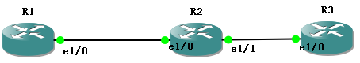

```txt
R1

conf t
int loo 0
ip add 1.1.1.1 255.255.255.255
no shut
int e1/0
ip add 1.2.0.1 255.255.255.0
no shut
end

show cdp ne
show ip int br

R2

conf t
int loo 0
ip add 2.2.2.2 255.255.255.255
no shut
int e1/0
ip add 1.2.0.2 255.255.255.0
no shut
int e1/1
ip add 2.3.0.2 255.255.255.0
no shut
end

show cdp ne
show ip int br

R3

conf t
int loo 0
ip add 3.3.3.3 255.255.255.255
no shut
int e1/0
ip add 2.3.0.3 255.255.255.0
no shut
end

show cdp ne
show ip int br
```
设置静态路由


```txt
R1

R1#conf t
R1(config)#ip route 2.2.2.2 255.255.255.255 1.2.0.2
R1(config)#ip route 3.3.3.3 255.255.255.255 1.2.0.2
R1(config)#ip route 2.3.0.0 255.255.255.0 1.2.0.2

R2

R2#conf t
R2(config)#ip route 1.1.1.1 255.255.255.255 1.2.0.1
R2(config)#ip route 3.3.3.3 255.255.255.255 2.3.0.3
R2(config)#end
R2#

R3(config)#ip route 1.1.1.1 255.255.255.255 2.3.0.2
R3(config)#ip route 2.2.2.2 255.255.255.255 2.3.0.2
R3(config)#ip route 1.2.0.0 255.255.255.0 2.3.0.2
R3(config)#end
R3#


R2#show ip route
Codes: L - local, C - connected, S - static

      1.0.0.0/8 is variably subnetted, 3 subnets, 2 masks
S        1.1.1.1/32 [1/0] via 1.2.0.1
C        1.2.0.0/24 is directly connected, Ethernet1/0
L        1.2.0.2/32 is directly connected, Ethernet1/0
      2.0.0.0/8 is variably subnetted, 3 subnets, 2 masks
C        2.2.2.2/32 is directly connected, Loopback0
C        2.3.0.0/24 is directly connected, Ethernet1/1
L        2.3.0.2/32 is directly connected, Ethernet1/1
      3.0.0.0/32 is subnetted, 1 subnets
S        3.3.3.3 [1/0] via 2.3.0.3
```

接口模式
```txt
R1

R1(config)#ip route 2.2.2.2 255.255.255.255 e1/0
R1(config)#ip route 3.3.3.3 255.255.255.255 e1/0
R1(config)#ip route 2.3.0.0 255.255.255.0 e1/0

R2

R2(config)#ip route 1.1.1.1 255.255.255.255 e1/0
R2(config)#ip route 3.3.3.3 255.255.255.255 e1/1

R3
R3(config)#ip route 2.2.2.2 255.255.255.255 e1/0
R3(config)#ip route 1.1.1.1 255.255.255.255 e1/0
R3(config)#ip route 1.2.0.0 255.255.255.0 e1/0

R3(config)#do show ip route
Codes: L - local, C - connected, S - static

      1.0.0.0/8 is variably subnetted, 2 subnets, 2 masks
S        1.1.1.1/32 is directly connected, Ethernet1/0
S        1.2.0.0/24 is directly connected, Ethernet1/0
      2.0.0.0/8 is variably subnetted, 3 subnets, 2 masks
S        2.2.2.2/32 is directly connected, Ethernet1/0
C        2.3.0.0/24 is directly connected, Ethernet1/0
L        2.3.0.3/32 is directly connected, Ethernet1/0
      3.0.0.0/32 is subnetted, 1 subnets
C        3.3.3.3 is directly connected, Loopback0

```