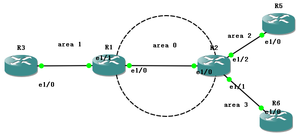

2019年3月27日在GNS3 1.5.9版本上做了cisco OSPF简单模拟实验



配置路由器
---
```txt

R3#conf t
Enter configuration commands, one per line.  End with CNTL/Z.
R3(config)#int loopback 0
R3(config-if)#ip add 3.3.3.3 255.255.255.0
R3(config-if)#no shut
R3(config-if)#int e1/0
R3(config-if)#ip add 13.0.0.3 255.255.255.0
R3(config-if)#no shut


R3(config)#router ospf 1
R3(config-router)#netw
R3(config-router)#network 3.3.3.3 0.0.0.0 area 1
R3(config-router)#network 3.0.0.0 0.0.0.255 area 1
R3(config-router)#end


R1路由器
R1#conf t
R1(config)#int loo 0
R1(config-if)#ip add 1.1.1.1 255.255.255.255
R1(config-if)#no shut
R1(config-if)#int e1/1
R1(config-if)#ip add 13.0.0.1 255.255.255.0
R1(config-if)#no shut
R1(config-if)#int e1/0
R1(config-if)#ip add 12.0.0.1 255.255.255.0
R1(config-if)#no shut
R1(config-if)#end

R1#conf t
R1(config)#router ospf 1
R1(config-router)#network 1.1.1.1 0.0.0.0 area 0
R1(config-router)#network 12.0.0.0 0.0.0.255 area 0
R1(config-router)#network 13.0.0.0 0.0.0.255 area 1
R1(config-router)#end

```
查看配置
---

```txt
R3#show running-config
version 12.3
!
hostname R3
!
interface Loopback0
 ip address 3.3.3.3 255.255.255.255
!
interface Ethernet1/0
 ip address 13.0.0.3 255.255.255.0
 duplex half
!
router ospf 1
 log-adjacency-changes
 network 3.3.3.3 0.0.0.0 area 1
 network 13.0.0.0 0.0.0.255 area 1


R3#show ip route
Codes: C - connected, S - static, R - RIP, M - mobile, B - BGP
       D - EIGRP, EX - EIGRP external, O - OSPF, IA - OSPF inter area
       N1 - OSPF NSSA external type 1, N2 - OSPF NSSA external type 2
       E1 - OSPF external type 1, E2 - OSPF external type 2
       i - IS-IS, su - IS-IS summary, L1 - IS-IS level-1, L2 - IS-IS level-2
       ia - IS-IS inter area, * - candidate default, U - per-user static route
       o - ODR, P - periodic downloaded static route

Gateway of last resort is not set

     1.0.0.0/32 is subnetted, 1 subnets
O IA    1.1.1.1 [110/11] via 13.0.0.1, 00:58:06, Ethernet1/0
     2.0.0.0/32 is subnetted, 1 subnets
O IA    2.2.2.2 [110/21] via 13.0.0.1, 00:58:06, Ethernet1/0
     3.0.0.0/32 is subnetted, 1 subnets
C       3.3.3.3 is directly connected, Loopback0
     5.0.0.0/32 is subnetted, 1 subnets
O IA    5.5.5.5 [110/31] via 13.0.0.1, 00:02:41, Ethernet1/0
     6.0.0.0/32 is subnetted, 1 subnets
O IA    6.6.6.6 [110/31] via 13.0.0.1, 00:58:06, Ethernet1/0
     25.0.0.0/24 is subnetted, 1 subnets
O IA    25.0.0.0 [110/30] via 13.0.0.1, 00:02:31, Ethernet1/0
     26.0.0.0/24 is subnetted, 1 subnets
O IA    26.0.0.0 [110/30] via 13.0.0.1, 00:58:07, Ethernet1/0
     12.0.0.0/24 is subnetted, 1 subnets
O IA    12.0.0.0 [110/20] via 13.0.0.1, 00:58:07, Ethernet1/0
     13.0.0.0/24 is subnetted, 1 subnets
C       13.0.0.0 is directly connected, Ethernet1/0


R3#show ip route ospf
     1.0.0.0/32 is subnetted, 1 subnets
O IA    1.1.1.1 [110/11] via 13.0.0.1, 00:57:30, Ethernet1/0
     2.0.0.0/32 is subnetted, 1 subnets
O IA    2.2.2.2 [110/21] via 13.0.0.1, 00:57:30, Ethernet1/0
     5.0.0.0/32 is subnetted, 1 subnets
O IA    5.5.5.5 [110/31] via 13.0.0.1, 00:02:05, Ethernet1/0
     6.0.0.0/32 is subnetted, 1 subnets
O IA    6.6.6.6 [110/31] via 13.0.0.1, 00:57:30, Ethernet1/0
     25.0.0.0/24 is subnetted, 1 subnets
O IA    25.0.0.0 [110/30] via 13.0.0.1, 00:01:55, Ethernet1/0
     26.0.0.0/24 is subnetted, 1 subnets
O IA    26.0.0.0 [110/30] via 13.0.0.1, 00:57:30, Ethernet1/0
     12.0.0.0/24 is subnetted, 1 subnets
O IA    12.0.0.0 [110/20] via 13.0.0.1, 00:57:30, Ethernet1/0

R3#show ip ospf database

            OSPF Router with ID (3.3.3.3) (Process ID 1)

                Router Link States (Area 1)

Link ID         ADV Router      Age         Seq#       Checksum Link count
1.1.1.1         1.1.1.1         1458        0x80000003 0x0044BE 1
3.3.3.3         3.3.3.3         1359        0x80000004 0x00478C 2

                Net Link States (Area 1)

Link ID         ADV Router      Age         Seq#       Checksum
13.0.0.1        1.1.1.1         1458        0x80000002 0x008492

                Summary Net Link States (Area 1)

Link ID         ADV Router      Age         Seq#       Checksum
1.1.1.1         1.1.1.1         1699        0x80000002 0x0045ED
2.2.2.2         1.1.1.1         1700        0x80000002 0x007BA9
5.5.5.5         1.1.1.1         46          0x80000001 0x0057B8
6.6.6.6         1.1.1.1         1699        0x80000002 0x0027E3
12.0.0.0        1.1.1.1         1699        0x80000002 0x0031F0
25.0.0.0        1.1.1.1         36          0x80000008 0x00DF25
26.0.0.0        1.1.1.1         1699        0x80000002 0x00DE2B
R3#ping 5.5.5.5

Type escape sequence to abort.
Sending 5, 100-byte ICMP Echos to 5.5.5.5, timeout is 2 seconds:
!!!!!
Success rate is 100 percent (5/5), round-trip min/avg/max = 28/44/72 ms
R3#


R3#show cdp neighbors
Capability Codes: R - Router, T - Trans Bridge, B - Source Route Bridge
                  S - Switch, H - Host, I - IGMP, r - Repeater

Device ID        Local Intrfce     Holdtme    Capability  Platform  Port ID
R1               Eth 1/0            131          R        7206VXR   Eth 1/1

R3#show ip in brief
Interface                  IP-Address      OK? Method Status                Protocol
FastEthernet0/0            unassigned      YES unset  administratively down down
Ethernet1/0                13.0.0.3        YES manual up                    up
Ethernet1/1                unassigned      YES unset  administratively down down
Ethernet1/2                unassigned      YES unset  administratively down down
Ethernet1/3                unassigned      YES unset  administratively down down
Loopback0                  3.3.3.3         YES manual up                    up

```