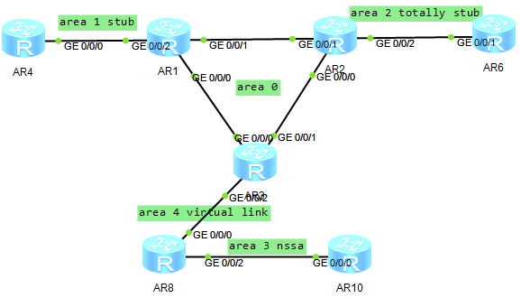

```txt
R1

sys
sysname R1
lldp en
int loo 0
ip add 1.1.1.1 32
q
int g0/0/0
ip add 1.3.0.1 24
undo shut
int g0/0/1
ip add 1.2.0.1 24
undo shut
int g0/0/2
ip add 1.4.0.1 24
undo shut
q

---------------------------------
R2

sys
sysname R2
lldp en
int loo 0
ip add 2.2.2.2 32
q
int g0/0/0
ip add 2.3.0.2 24
undo shut
int g0/0/1
ip add 1.2.0.2 24
undo shut
int g0/0/2
ip add 2.6.0.2 24
undo shut
q

--------------------
R3

sys
sysname R3
lldp en
int loo 0
ip add 3.3.3.3 32
q
int g0/0/0
ip add 1.3.0.3 24
undo shut
int g0/0/1
ip add 2.3.0.3 24
undo shut
int g0/0/2
ip add 3.8.0.3 24
undo shut
q

-------------------------
R4

sys
sysname R4
lldp en
int loo 0
ip add 4.4.4.4 32
q
int g0/0/0
ip add 1.4.0.4 24
undo shut
int g0/0/1
ip add 4.5.0.4 24
undo shut
q

---------------------------
R6

sys
sysname R6
lldp en
int loo 0
ip add 6.6.6.6 32
q
int g0/0/0
ip add 6.7.0.6 24
undo shut
int g0/0/1
ip add 2.6.0.6 24
undo shut
q

------------------------------
R8

sys
sysname R8
lldp en
int loo 0
ip add 8.8.8.8 32
q
int g0/0/0
ip add 3.8.0.8 24
undo shut
int g0/0/1
ip add 8.9.0.8 24
undo shut
int g0/0/2
ip add 8.10.0.8 24
undo shut
q
-----------------------
R10

sys
sysname R10
lldp en
int loo 0
ip add 10.10.10.10 32
q
int g0/0/0
ip add 8.10.0.10 24
undo shut
int g0/0/1
ip add 10.11.0.10 24
undo shut
q

-------------
配置ospf 
R1
ospf 1
area 0
net 1.1.1.1 0.0.0.0
net 1.2.0.0 0.0.0.255
net 1.3.0.0 0.0.0.255
q
area 1
net 1.4.0.0 0.0.0.255
stub
q

R2
ospf 1
area 0 
net 2.2.2.2 0.0.0.0
net 1.2.0.0 0.0.0.255
net 2.3.0.0 0.0.0.255
q
area 2
net 2.6.0.0 0.0.0.255
stub no-summary
q

R3
ospf 1
area 0
net 3.3.3.3 0.0.0.0
net 1.3.0.0 0.0.0.255
net 2.3.0.0 0.0.0.255
q
area 4
net 3.8.0.0 0.0.0.255
vlink-peer 8.8.8.8
q

R4
ospf 1
area 1
net 4.4.4.4 0.0.0.0
net 1.4.0.0 0.0.0.255
stub
q

R6
ospf 1
area 2
net 6.6.6.6 0.0.0.0
net 2.6.0.0 0.0.0.255
stub no-summary
q

R8
ospf 1
area 4
net 8.8.8.8 0.0.0.0
net 3.8.0.0 0.0.0.255
vlink-peer 3.3.3.3
q
area 3
net 8.10.0.0 0.0.0.255
nssa
q

R10
ospf 1
area 3
net 10.10.10.10 0.0.0.0
net 8.10.0.0 0.0.0.255
nssa
q

```