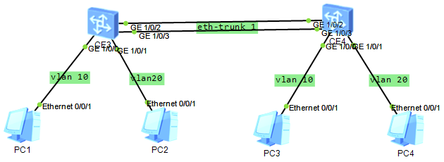

规划
```txt
VLAN 10 192.168.10.0/24
VLAN 20 192.168.20.0/24

PC1 IP ADDR 192.168.10.11
PC2 IP ADDR 192.168.20.11

PC3 IP ADDR 192.168.10.12
PC4 IP ADDR 192.168.20.12
```


SW1
```txt
[~SW1]vlan 10
[*SW1-vlan10]q
[*SW1]vlan 20
[*SW1-vlan20]q

[~SW1]int Eth-Trunk 1
[~SW1-Eth-Trunk1]port link-type trunk
[~SW1-Eth-Trunk1]port trunk allow-pass vlan 10 20
[*SW1-Eth-Trunk1]q
[*SW1]comm

[*SW1]int g1/0/0	
[*SW1-GE1/0/0]port link-type access 	
[*SW1-GE1/0/0]port default vlan 10
[*SW1-GE1/0/0]q
[*SW1]int g1/0/1
[*SW1-GE1/0/1]port link-type acc	
[*SW1-GE1/0/1]port default vlan 20
[*SW1-GE1/0/1]q
[*SW1]comm

[~SW1]int GE 1/0/2
[~SW1-GE1/0/2]et	
[~SW1-GE1/0/2]eth-trunk 1
[~SW1-GE1/0/2]undo shut
[~SW1-GE1/0/2]q
[~SW1]int GE 1/0/3
[~SW1-GE1/0/3]et	
[~SW1-GE1/0/3]eth-trunk 1
[~SW1-GE1/0/3]undo shut
[~SW1-GE1/0/3]q
[~SW1]comm

[~SW1]dis eth-trunk 1
Eth-Trunk1's state information is:
Working Mode: Normal        Hash Arithmetic: According to flow
Least Active-linknumber: 1  Max Bandwidth-affected-linknumber: 32
Operating Status: up        Number of Up Ports in Trunk: 2
--------------------------------------------------------------------------------
PortName                      Status      Weight
GE1/0/2                       Up          1          
GE1/0/3                       Up          1          
```

SW2
```txt
[~SW2]vlan 10
[*SW2-vlan10]q
[*SW2]vlan 20
[*SW2-vlan20]q

[~SW2]int Eth-Trunk 1
[~SW2-Eth-Trunk1]port link-type trunk 
[~SW2-Eth-Trunk1]port trunk allow-pass vlan 10 20
[*SW2-Eth-Trunk1]q
[*SW2]com

[*HUAWEI]int g1/0/2
[*HUAWEI-GE1/0/2]eth-trunk 1
[*HUAWEI-GE1/0/2]undo shut
[*HUAWEI-GE1/0/2]q
[*HUAWEI]int GE 1/0/3
[*HUAWEI-GE1/0/3]eth-trunk 1
[*HUAWEI-GE1/0/2]undo shut
[*HUAWEI-GE1/0/3]q
[*HUAWEI]comm


[~SW2]int g1/0/0	
[~SW2-GE1/0/0]port link-type acc
[~SW2-GE1/0/0]port default vlan 10
[*SW2]int g1/0/1
[*SW2-GE1/0/1]port default vlan 20
[*SW2-GE1/0/1]undo shut
[*SW2-GE1/0/1]q
[*SW2]comm
[~SW2]
```